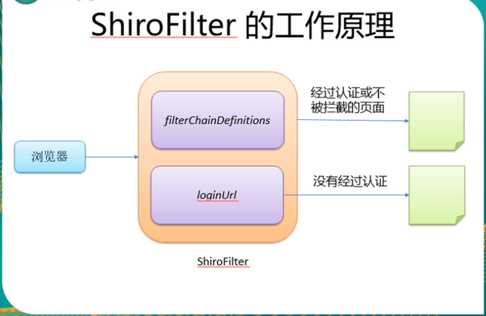

## spring学习

### 服务器的三层框架

Springmvc框架基于组件方式的执行流程

## java 三大器

### 1 拦截器

#### 1.1 实例

~~~java
public class HandlerInterceptor1 implements HandlerInterceptor{
         /**

          *  进入handler方法之前执行

          *  用于身份认证，身份校验

          *  比如身份认证，如果认证不通过表示当前用户没有登录，需要此方法拦截不在向下执行

          */

         @Override

         public boolean preHandle(HttpServletRequest arg0, HttpServletResponse arg1, Object arg2) throws Exception {
                   // TODO Auto-generated method stub
                   return false;
         }
         /**

          *  进入handler之后，返回modelandview之前执行

          *  应用场景从modelandview出发，将共用的模型数据（比如菜单导航）在这里传到视图，也可以在这里统一制定视图

          */

         @Override

         public void postHandle(HttpServletRequest arg0, HttpServletResponse arg1, Object arg2, ModelAndView arg3) throws Exception {

                   // TODO Auto-generated method stub
         }
         /**

          *  执行handler完成执行此方法

          *  应用场景：统一异常处理，统一日志处理

          */

         @Override
         public void afterCompletion(HttpServletRequest arg0, HttpServletResponse arg1, Object arg2, Exception arg3)
                            throws Exception {
                   // TODO Auto-generated method stub
         }
}
~~~

#### 1.2配置拦截器

~~~
在springmvc的前端控制器配置文件中配置interceptor拦截器
<!-- 配置拦截器 -->
                 <mvc:interceptors>
              <!-- 多个拦截器,顺序执行 -->
                          <!-- 登录认证拦截器 -->
                           <mvc:interceptor>
                              <mvc:mapping path="/**"/><!-- 标识拦截所有的URL包括所有的子URL -->
                             <bean class="com.jch.interceptor.LoginInterceptor"></bean>
                           </mvc:interceptor>
                 </mvc:interceptors>
~~~

#### 1.3 登录拦截实现

~~~
public class LoginInterceptor implements HandlerInterceptor{

 

         /**

          *  进入handler方法之前执行

          *  用于身份认证，身份校验

          *  比如身份认证，如果认证不通过表示当前用户没有登录，需要此方法拦截不在向下执行

          */

         @Override

         public boolean preHandle(HttpServletRequest request, HttpServletResponse response, Object handler) throws Exception {

                   // TODO Auto-generated method stub

                   // 获取请求的URL

                   String url = request.getRequestURI();

                   // 判断是否是公开地址（实际使用将公开地址配置在配置文件中）这里公开地址就是登录提交的地址

                   if(url.indexOf("login.jch")>=0) {

                            // 如果要登录提交，那么放行

                            return true;

                   }

                   // 判断session

                   HttpSession session = request.getSession();

                   String username = (String)session.getAttribute("username");

                   if(username != null) {

                            // 有身份信息，放行

                            return true;

                   }

                  

                   // 身份验证不通过跳转到登录界面

                   request.getRequestDispatcher("/views/home/login.jsp").forward(request, response);

                   System.out.println("这是第1个拦截器，preHandle方法");

                   return false;

         }

        

         /**

          *  进入handler之后，返回modelandview之前执行

          *  应用场景从modelandview出发，将共用的模型数据（比如菜单导航）在这里传到视图，也可以在这里统一制定视图

          */

         @Override

         public void postHandle(HttpServletRequest arg0, HttpServletResponse arg1, Object arg2, ModelAndView arg3)

                            throws Exception {

                   // TODO Auto-generated method stub

                   System.out.println("这是第1个拦截器，postHandle方法");

                  

         }

 

         /**

          *  执行handler完成执行此方法

          *  应用场景：统一异常处理，统一日志处理

          */

         @Override

         public void afterCompletion(HttpServletRequest arg0, HttpServletResponse arg1, Object arg2, Exception arg3)
                            throws Exception {
                   // TODO Auto-generated method stub
                   System.out.println("这是第1个拦截器， afterCompletion方法");
         }
}
~~~

### 2 过滤器

### 3 监听器

### 4 shiro

~~~
anon 不需要认证，即可访问的页面。
auth 必须认证(登陆)后才可以访问的页面。
~~~

#### 4.1 配置文件

##### 4.1.1 web.xml

~~~xml
<!-- 配置shiro过滤器，用来拦截所有请求，进行认证和授权 -->
  <filter>
    <filter-name>shiroFilter</filter-name>
    <filter-class>org.springframework.web.filter.DelegatingFilterProxy</filter-class>
    <!-- 将当前的Filter的生命周期将由web容器管理 -->
    <init-param>
      <param-name>targetFilterLifecycle</param-name>
      <param-value>true</param-value>
    </init-param>
  </filter>
 
  <filter-mapping>
    <filter-name>shiroFilter</filter-name>
    <url-pattern>/*</url-pattern>
  </filter-mapping>
~~~

##### 4.1.2 spring-shiro.xml

~~~
<?xml version="1.0" encoding="UTF-8"?>
<beans xmlns="http://www.springframework.org/schema/beans"
       xmlns:xsi="http://www.w3.org/2001/XMLSchema-instance"
       xsi:schemaLocation="http://www.springframework.org/schema/beans
       http://www.springframework.org/schema/beans/spring-beans.xsd">
 
    <!-- 第四步 -->
    <!-- 配置密码匹配器-->
    <bean id="credentialsMatcher" class="org.apache.shiro.authc.credential.HashedCredentialsMatcher">
        <property name="hashAlgorithmName" value="MD5"/>
        <property name="hashIterations" value="3"/>
        <!-- 设置成false，表示用base64加密，默认是true，加密方式为hex-->
        <property name="storedCredentialsHexEncoded" value="false"/>
    </bean>
 
    <!-- 第三步 -->
    <!-- 配置realm-->
    <bean id="realm" class="com.zsm.shiro.JdbcSaltRealm">
        <!-- 注入DataSource -->
        <property name="dataSource" ref="dataSource"/>
        <!-- 注入密码匹配器 -->
        <property name="credentialsMatcher" ref="credentialsMatcher"/>
        <!-- 重写带salt认证的sql-->
        <property name="authenticationQuery">
            <value>
                select password,login_name from t_user where login_name=?
            </value>
        </property>
    </bean>
 
    <!-- 第二步 -->
    <!-- 配置-securityManager -->
    <bean id="securityManager" class="org.apache.shiro.web.mgt.DefaultWebSecurityManager">
        <property name="realms">
            <list>
                <ref bean="realm"/>
            </list>
        </property>
    </bean>
 
    <!-- 第一步 -->
    <!-- 定义一个名为shiroFilter的bean，用来配置url过滤规则-->
    <bean id="shiroFilter" class="org.apache.shiro.spring.web.ShiroFilterFactoryBean">
        <property name="securityManager" ref="securityManager"/>
    </bean>
</beans>
~~~

##### 4.1.3 pom.xml

### 5  java 词汇

~~~
POJO  简单老式jav对象  plain old java object
DI  依赖注入  Dependency Injection
AOP 面向切面编程  Aspect Oriented Programming
应用上下文 application context
前置通知 before advice
后置通知 after advice
~~~

### 6 装配Bean

#### 6.1 应用上下文

~~~
FileSystemXmlApplicationContext 文件系统中加载应用上下文
ClassPathXmlApplicationContext 类路径中加载上下文
~~~

#### 6.2 装配bean

##### 6.2.1 自动化装配bean

~~~markdown
@ComponentScan --这个注解能够在sping中启用组件扫描，如果没有其他配置的话，@ComponentScan默认回扫描与配置类相同的包。以及包下的所有子包。

第二种方式，使用xml配置文件来启用组件扫描
<context:component-scan base-package="" />
~~~

##### 6.2.2 javaconfig

~~~
@configuration
@bean
~~~

##### 6.2.3 XML装配bean

~~~
<bean id="compactiDisc" class="com.soundsystem.SgtPeppers" />
~~~

###### 6.2.3.1 字面量注入构造器

~~~java
public class BlankDisc implements CompactDisc{
	private String title;
    private String artist;
    
    public BlankDisc(String title,String artist){
        this.title=title;
        this.artist=artist;
    }
    public void play(){
        System.out.println("play"+title+"by"+artist);
    }
}

--xml 装配bean
<bean id="compactDisc" class="com.soundSystem.BlankDisc">
	<constractor-arg value="my is title value"/>
	<constractor-agr value="my is artist value"/>
</bean>
~~~

###### 6.2.3.2 装配集合

~~~java
public class BlankDisc implements CompactDisc(){
	private String title;
    private String artist;
    private List<String> tracks;
    
    public BlankDisc(String title,String artist,List<String>tracks){
        this.title=title;
        this.artist=artist;
        this.tracks=tracks;
    }
    public void play(){
       System.out.println("play"+title+"by"+artist);
        for(String track:tracks){
            System.out.println("Track"+track);
        }
    }
}

--xml 装配bean  
--list集合 是一个存取有序的集合，可以存在重复的元素
<bean id="compactDisc" class="com.soundSystem.BlankDisc">
	<constractor-arg value="my is title value"/>
	<constractor-agr value="my is artist value"/>
	<constractor-arg>
		<list>
			<value>track1</value>	
			<value>track2</value>	
    	</list>
    </constractor-arg>
</bean>

--set集合 会去除重复元素 而且存储无序。
<bean id="compactDisc" class="com.soundSystem.BlankDisc">
	<constractor-arg value="my is title value"/>
	<constractor-agr value="my is artist value"/>
	<constractor-arg>
		<set>
			<value>track1</value>	
			<value>track2</value>	
    	</set>
    </constractor-arg>
</bean>

--装配集合
<constractor-arg>
		<list>
			<ref bean="bean1" />
    		<ref bean="bean2" />
    	</list>
</constractor-arg>
~~~

###### 6.2.3.3 字面量注入到属性中

~~~java
public class BlankDisc implements CompactDisc(){
	private String title;
    private String artist;
    private List<String> tracks;
    
    public BlankDisc(String title,String artist,List<String>tracks){
        this.title=title;
        this.artist=artist;
        this.tracks=tracks;
    }
    public void setTitle(String title){
        this.title=title;
    }
    public void setartist(String artist){
     	this.artist=artist;   
    }
    public void setTracks(List<String>tracks ){
        this.tracks=tracks;
    }   
    
    public void play(){
       System.out.println("play"+title+"by"+artist);
        for(String track:tracks){
            System.out.println("Track"+track);
        }
    }
}
--装配属性
<bean id="compactDisc" class="com.soundsystem.BlankDisc">
	<property name="title" value="titlevalue" />
    <property name="artist" value="artistvalue" />
    <property name="tracks">
    	<list>
    		<value>value1</value>
    		<value>value2</value>
    	</list>
    </property>
</bean>
~~~

##### 6.2.4 xml和javaconfig混合

~~~
@import @improtResources

@Import注解是引入带有@Configuration的java类。
@ImportResource是引入spring配置文件.xml

~~~

#### 6.4 spring容器

~~~
在spring ioc容器读取bean配置实例化bean之前，必须对spring容器实例化，只有在容器实例化，才可以从ioc容器里获取bean实例并使用。
spring提供了两种ioc容器的实现方式
	1 BeanFactory ioc容器的基本实现
	2 applicationContext 
	
applicationContext的两个接口
	1 FileSystemXmlApplicationContext 文件系统中加载应用上下文
	2 ClassPathXmlApplicationContext 类路径中加载上下文
~~~

#### 6.5 依赖注入的方式

~~~
属性注入
<property name="" value="" />
构造器注入
<constractor-arg value="" type="double">
<constractor-arg value="" type="int"> --通过字段类型区分

<constractor-arg value="" index="0">-- 通过序号来区分
~~~

