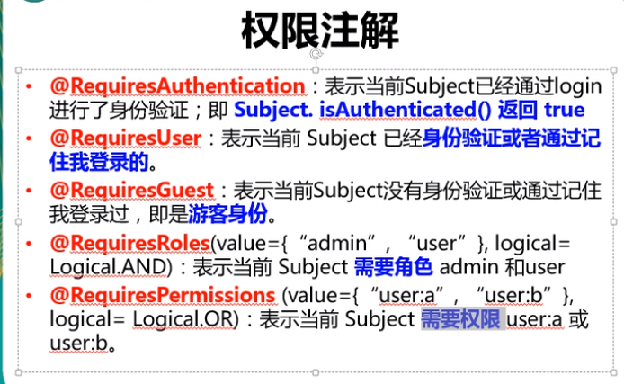
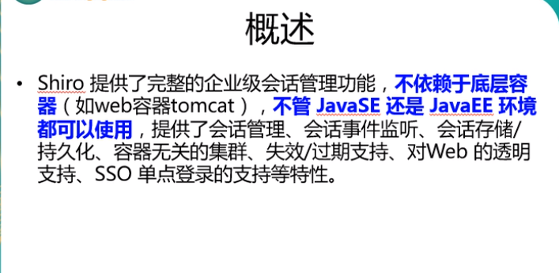
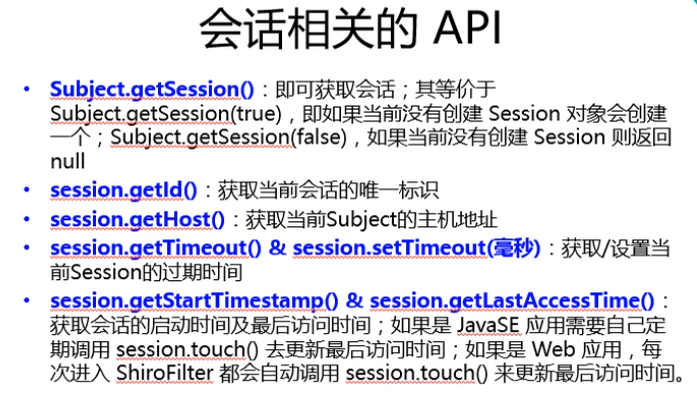
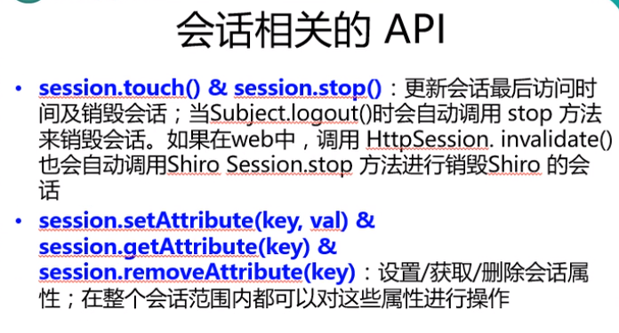
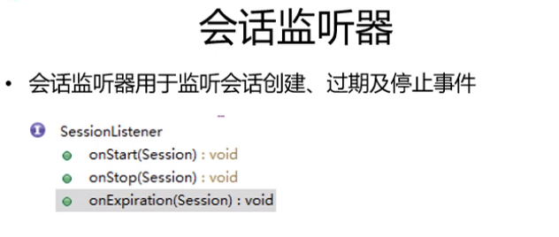
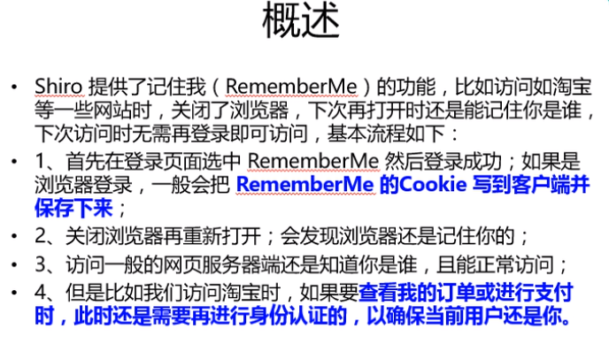

# 权限管理

## 1 用户认证管理

~~~java
public class shiroRealm extends AuthenticatingRealm {
	
	@Override
	protected AuthenticationInfo doGetAuthenticationInfo(AuthenticationToken authenticationToken) throws AuthenticationException {
		System.out.println("doGetAuthenticationInfo--> "+authenticationToken);
		UsernamePasswordToken uptoken= (UsernamePasswordToken) authenticationToken;
		String username=uptoken.getUsername();
		/*模拟从数据库中获取用户名*/
		if("unkonw".equals(username)){
			throw new  UnknownAccountException("用户不存在！");
		}
		if("monster".equals(username)){
			throw  new LockedAccountException("用户被锁定！");
		}
		Object principal=username;
		Object credentials="123";
		String realName=getName();
		SimpleAuthenticationInfo info=new SimpleAuthenticationInfo(principal,credentials,realName);
		return info;
	}
}
~~~

### 1.1 密码加密比对

~~~java
<bean id="shiroRealm" class="com.richard.shiro.Realm.shiroRealm">
        <property name="credentialsMatcher">
            <bean class="org.apache.shiro.authc.credential.HashedCredentialsMatcher">
                <property name="hashAlgorithmName" value="MD5"></property>
                <property name="hashIterations" value="512"></property>
            </bean>
        </property>
    </bean>
    
    @Override
	protected AuthenticationInfo doGetAuthenticationInfo(AuthenticationToken authenticationToken) throws AuthenticationException {
		System.out.println("doGetAuthenticationInfo--> "+authenticationToken);
		UsernamePasswordToken uptoken= (UsernamePasswordToken) authenticationToken;
		String username=uptoken.getUsername();
		/*从数据库中获取用户名*/
		if("unkonw".equals(username)){
			throw new  UnknownAccountException("用户不存在！");
		}
		if("monster".equals(username)){
			throw  new LockedAccountException("用户被锁定！");
		}
		/*用户名*/
		Object principal=username;
		/*从数据库中取的密码*/
		Object credentials=null;  //"9d385694aae96dbec50fb8d493008fe0";
		if("admin".equals(username)){
			credentials="980b4de97c8a074c423649cca19c33af";
		}else if("user".equals(username)){
			credentials="9b14022297db4db100c6bbfd69f777d0";
		}
		/*盐值*/
		ByteSource credentialsSalt=ByteSource.Util.bytes(username);
		/*realm名*/
		String realName=getName();
		SimpleAuthenticationInfo info=null; // new SimpleAuthenticationInfo(principal,credentials,realName);
		
		info=new SimpleAuthenticationInfo(principal,credentials,credentialsSalt,realName);
		return info;
	}
~~~

### 1.3  MD5盐值加密

~~~
1. 为什么使用 MD5 盐值加密: 
2. 如何做到:
1). 在 doGetAuthenticationInfo 方法返回值创建 SimpleAuthenticationInfo 对象的时候, 需要使用
SimpleAuthenticationInfo(principal, credentials, credentialsSalt, realmName) 构造器
2). 使用 ByteSource.Util.bytes() 来计算盐值. 
3). 盐值需要唯一: 一般使用随机字符串或 user id
4). 使用 new SimpleHash(hashAlgorithmName, credentials, salt, hashIterations); 来计算盐值加密后的密码的值. 
~~~

### 1.4 多realm认证

~~~xml
--1   authenticator
 <bean id="securityManager" class="org.apache.shiro.web.mgt.DefaultWebSecurityManager">
        <property name="cacheManager" ref="cacheManager"/>
        <property name="authenticator" ref="authenticator"></property>
        <!--<property name="realm" ref="shiroRealm"></property>-->
        <property name="rememberMeManager.cookie.maxAge" value="10"></property>
    </bean>
    
 --2 
 
    <bean id="shiroRealm" class="com.richard.shiro.Realm.shiroRealm">
        <property name="credentialsMatcher">
            <bean class="org.apache.shiro.authc.credential.HashedCredentialsMatcher">
                <property name="hashAlgorithmName" value="MD5"></property>
                <property name="hashIterations" value="512"></property>
            </bean>
        </property>
    </bean>

    <bean id="secondRealm" class="com.richard.shiro.Realm.secondRealm">
        <property name="credentialsMatcher">
            <bean class="org.apache.shiro.authc.credential.HashedCredentialsMatcher">
                <property name="hashAlgorithmName" value="MD5"></property>
                <property name="hashIterations" value="512"></property>
            </bean>
        </property>
    </bean>
   
    <bean id="authenticator" class="org.apache.shiro.authc.pam.ModularRealmAuthenticator">
        <property name="realms">
            <list>
                <ref bean="shiroRealm"></ref>
                <ref bean="secondRealm"></ref>
            </list>
        </property>
        <!--多个realm的时候配置认证策略 默认只要一个通过就通过-->
        <property name="authenticationStrategy">
            <!--所有的认证都通过才通过-->
            <!--<bean class="org.apache.shiro.authc.pam.AllSuccessfulStrategy"></bean>-->
            <bean class="org.apache.shiro.authc.pam.AtLeastOneSuccessfulStrategy"></bean>
        </property>
    </bean>
~~~

### 1.5 多realm认证2

~~~xml
<!--
    1. 配置 SecurityManager!
    -->
    <bean id="securityManager" class="org.apache.shiro.web.mgt.DefaultWebSecurityManager">
        <property name="cacheManager" ref="cacheManager"/>
        <property name="authenticator" ref="authenticator"></property>
        <property name="realms">
            <list>
                <ref bean="shiroRealm"></ref>
                <ref bean="secondRealm"></ref>
            </list>
        </property>
        <property name="rememberMeManager.cookie.maxAge" value="10"></property>
    </bean>
    

<!--
    	3. 配置 Realm
    	3.1 直接配置实现了 org.apache.shiro.realm.Realm 接口的 bean
    -->

    <bean id="shiroRealm" class="com.richard.shiro.Realm.shiroRealm">
        <property name="credentialsMatcher">
            <bean class="org.apache.shiro.authc.credential.HashedCredentialsMatcher">
                <property name="hashAlgorithmName" value="MD5"></property>
                <property name="hashIterations" value="512"></property>
            </bean>
        </property>
    </bean>

    <bean id="secondRealm" class="com.richard.shiro.Realm.secondRealm">
        <property name="credentialsMatcher">
            <bean class="org.apache.shiro.authc.credential.HashedCredentialsMatcher">
                <property name="hashAlgorithmName" value="SHA1"></property>
                <property name="hashIterations" value="512"></property>
            </bean>
        </property>
    </bean>

    <bean id="authenticator" class="org.apache.shiro.authc.pam.ModularRealmAuthenticator">
        <!--realms 放到securityManager的realms中-->
        <!--<property name="realms">
            <list>
                <ref bean="shiroRealm"></ref>
                <ref bean="secondRealm"></ref>
            </list>
        </property>-->
        <!--多个realm的时候配置认证策略 默认只要一个通过就通过-->
        <property name="authenticationStrategy">
            <!--所有的认证都通过才通过-->
            <!--<bean class="org.apache.shiro.authc.pam.AllSuccessfulStrategy"></bean>-->
            <bean class="org.apache.shiro.authc.pam.AtLeastOneSuccessfulStrategy"></bean>
        </property>
    </bean>
~~~

## 2用户授权管理

~~~markdown
shiro 中的AuthorizingRealm有2个方法doGetAuthorizationInfo()和doGetAuthenticationInfo(),一般实际开发中，

我们都继承AuthorizingRealm类然后重写doGetAuthorizationInfo和doGetAuthenticationInfo。         

doGetAuthenticationInfo这个方法是在用户登录的时候调用的也就是执行SecurityUtils.getSubject().login（）的时候调用；(即:登录验证)

而doGetAuthorizationInfo方法是在我们调用SecurityUtils.getSubject().isPermitted（）这个方法时会调用doGetAuthorizationInfo（），

而我们的@RequiresPermissions这个注解起始就是在执行SecurityUtils.getSubject().isPermitted（）。

我们在某个方法上加上@RequiresPermissions这个，那么我们访问这个方法的时候，就会自动调用SecurityUtils.getSubject().isPermitted（），从而区调用doGetAuthorizationInfo 匹配
 
~~~

### 2.1  roles[]

~~~xml
--shiro-config.xml

<bean id="shiroFileter" class="org.apache.shiro.spring.web.ShiroFilterFactoryBean">
        <property name="securityManager" ref="securityManager"/>
        <property name="loginUrl" value="/login.jsp"/>
        <property name="successUrl" value="/list.jsp"/>
        <property name="unauthorizedUrl" value="/unauthorized.jsp"/>

        <!--
        	配置哪些页面需要受保护.
        	以及访问这些页面需要的权限.
        	1). anon 可以被匿名访问
        	2). authc 必须认证(即登录)后才可能访问的页面.
        	3). logout 登出.
        	4). roles 角色过滤器
        -->
        <property name="filterChainDefinitions">
            <value>
                /login.jsp = anon
                /shiro/login=anon
                /shiro/logout=logout
                /user.jsp=roles[user]
                /admin.jsp=roles[admin]
                # everything else requires authentication:
                /** = authc
            </value>
       </property>
</bean>
~~~

### 2.2 授权

~~~java
1. 授权需要继承 AuthorizingRealm 类, 并实现其 doGetAuthorizationInfo 方法
2. AuthorizingRealm 类继承自 AuthenticatingRealm, 但没有实现 AuthenticatingRealm 中的 
doGetAuthenticationInfo, 所以认证和授权只需要继承 AuthorizingRealm 就可以了. 同时实现他的两个抽象方法.

public class testRealm extends AuthorizingRealm {
	/*授权*/
	@Override
	protected AuthorizationInfo doGetAuthorizationInfo(PrincipalCollection principalCollection) {
		return null;
	}
	/*用于授权*/
	@Override
	protected AuthorizationInfo doGetAuthorizationInfo(PrincipalCollection principalCollection) {
		System.out.println("doGetAuthorizationInfo --> "+principalCollection);
		/*1 获取登录用户信息  如果是多个realm,获取最优先的那个 */
		Object principal=principalCollection.getPrimaryPrincipal();
		/*2 获取当前用户的角色或者权限*/
		Set<String> roles=new HashSet<>();
		roles.add("user");
		if("admin".equals(principal)){
			roles.add("admin");
		}
		/*3 创建SimpleAuthorizationInfo 并设置其roles属性*/
		SimpleAuthorizationInfo info=new SimpleAuthorizationInfo(roles);
		return info;
	}
}
~~~

### 2.3 权限注解

~~~
@RequiresAuthentication 表示当前subject已经通过login进行了身份认证，
~~~

## 3 拦截器 (2019年9月14日13:13:04)

~~~java
anon anonymous 拦截器表示匿名访问，不需要登陆即可访问
auth  authentication 拦截器表示需要身份认证通过才可以访问 

--filterChainDefinitionMap   拦截器中的过滤器链

<bean id="shiroFileter" class="org.apache.shiro.spring.web.ShiroFilterFactoryBean">
        <property name="securityManager" ref="securityManager"/>
        <property name="loginUrl" value="/login.jsp"/>
        <property name="successUrl" value="/list.jsp"/>
        <property name="unauthorizedUrl" value="/unauthorized.jsp"/>

        <property name="filterChainDefinitionMap" ref="filterChainDefinitionMap"></property>
        
    </bean>

    <!-- 配置一个 bean, 该 bean 实际上是一个 Map. 通过实例工厂方法的方式 -->
    <bean id="filterChainDefinitionMap"
          factory-bean="filterChainDefinitionMapBuilder" factory-method="buildFilterChainDefinitionMap"></bean>

    <bean id="filterChainDefinitionMapBuilder"
          class="com.richard.shiro.filterChain.FilterChainDefinitionMapBuilder"></bean>

public class FilterChainDefinitionMapBuilder {
	public LinkedHashMap<String,String> buildFilterChainDefinitionMap(){
		LinkedHashMap<String,String>map=new LinkedHashMap<>();
		map.put("/login.jsp", "anon");
		map.put("/shiro/login", "anon");
		map.put("/shiro/logout", "logout");
		map.put("/user.jsp", "authc,roles[user]");
		map.put("/admin.jsp", "authc,roles[admin]");
		map.put("/list.jsp", "user");
		
		map.put("/**", "authc");
		return map;
	}
}

~~~

## 4 配置文件

### 4.1  eheache.xml

~~~xml

<?xml version="1.0" encoding="UTF-8"?>
<ehcache xmlns:xsi="http://www.w3.org/2001/XMLSchema-instance"
         xsi:noNamespaceSchemaLocation="http://ehcache.org/ehcache.xsd"
         updateCheck="false">
    <!--
       diskStore：为缓存路径，ehcache分为内存和磁盘两级，此属性定义磁盘的缓存位置。参数解释如下：
       user.home – 用户主目录
       user.dir  – 用户当前工作目录
       java.io.tmpdir – 默认临时文件路径
     -->
    <diskStore path="java.io.tmpdir/Tmp_EhCache"/>
    <!--
       defaultCache：默认缓存策略，当ehcache找不到定义的缓存时，则使用这个缓存策略。只能定义一个。
     -->
    <!--
      name:缓存名称。
      maxElementsInMemory:缓存最大数目
      maxElementsOnDisk：硬盘最大缓存个数。
      eternal:对象是否永久有效，一但设置了，timeout将不起作用。
      overflowToDisk:是否保存到磁盘，当系统当机时
      timeToIdleSeconds:设置对象在失效前的允许闲置时间（单位：秒）。仅当eternal=false对象不是永久有效时使用，可选属性，默认值是0，也就是可闲置时间无穷大。
      timeToLiveSeconds:设置对象在失效前允许存活时间（单位：秒）。最大时间介于创建时间和失效时间之间。仅当eternal=false对象不是永久有效时使用，默认是0.，也就是对象存活时间无穷大。
      diskPersistent：是否缓存虚拟机重启期数据 Whether the disk store persists between restarts of the Virtual Machine. The default value is false.
      diskSpoolBufferSizeMB：这个参数设置DiskStore（磁盘缓存）的缓存区大小。默认是30MB。每个Cache都应该有自己的一个缓冲区。
      diskExpiryThreadIntervalSeconds：磁盘失效线程运行时间间隔，默认是120秒。
      memoryStoreEvictionPolicy：当达到maxElementsInMemory限制时，Ehcache将会根据指定的策略去清理内存。默认策略是LRU（最近最少使用）。你可以设置为FIFO（先进先出）或是LFU（较少使用）。
      clearOnFlush：内存数量最大时是否清除。
      memoryStoreEvictionPolicy:可选策略有：LRU（最近最少使用，默认策略）、FIFO（先进先出）、LFU（最少访问次数）。
      FIFO，first in first out，这个是大家最熟的，先进先出。
      LFU， Less Frequently Used，就是上面例子中使用的策略，直白一点就是讲一直以来最少被使用的。如上面所讲，缓存的元素有一个hit属性，hit值最小的将会被清出缓存。
      LRU，Least Recently Used，最近最少使用的，缓存的元素有一个时间戳，当缓存容量满了，而又需要腾出地方来缓存新的元素的时候，那么现有缓存元素中时间戳离当前时间最远的元素将被清出缓存。
   -->
    <defaultCache
            eternal="false"
            maxElementsInMemory="10000"
            overflowToDisk="false"
            diskPersistent="false"
            timeToIdleSeconds="1800"
            timeToLiveSeconds="259200"
            memoryStoreEvictionPolicy="LRU"/>

    <cache
            name="cloud_user"
            eternal="false"
            maxElementsInMemory="5000"
            overflowToDisk="false"
            diskPersistent="false"
            timeToIdleSeconds="1800"
            timeToLiveSeconds="1800"
            memoryStoreEvictionPolicy="LRU"/>

</ehcache>
~~~

### 4.2 shiro-config.xml

~~~xml
<?xml version="1.0" encoding="UTF-8"?>
<beans xmlns="http://www.springframework.org/schema/beans"
       xmlns:xsi="http://www.w3.org/2001/XMLSchema-instance"
       xsi:schemaLocation="http://www.springframework.org/schema/beans
	http://www.springframework.org/schema/beans/spring-beans.xsd">
    <!--
    1. 配置 SecurityManager!
    -->
    <bean id="securityManager" class="org.apache.shiro.web.mgt.DefaultWebSecurityManager">
        <property name="cacheManager" ref="cacheManager"/>
        <property name="authenticator" ref="authenticator"></property>
        <property name="realms">
            <list>
                <ref bean="jdbcRealm"/>
                <ref bean="secondRealm"/>
            </list>
        </property>
        <property name="rememberMeManager.cookie.maxAge" value="10"></property>
    </bean>
    <bean id="cacheManager" class="org.apache.shiro.cache.ehcache.EhCacheManager">
        <property name="cacheManagerConfigFile" value="classpath:shiro/ehcache.xml"/>
    </bean>

    <bean id="authenticator"
          class="org.apache.shiro.authc.pam.ModularRealmAuthenticator">
        <property name="authenticationStrategy">
            <bean class="org.apache.shiro.authc.pam.AtLeastOneSuccessfulStrategy"></bean>
        </property>
    </bean>

    <!-- Used by the SecurityManager to access security data (users, roles, etc).
         Many other realm implementations can be used too (PropertiesRealm,
         LdapRealm, etc. -->
    <!--
    	3. 配置 Realm
    	3.1 直接配置实现了 org.apache.shiro.realm.Realm 接口的 bean
    -->
    <bean id="jdbcRealm" class="com.richard.shiro.Realm.jdbcRealm">

    </bean>

    <bean id="secondRealm" class="com.richard.shiro.Realm.secondRealm">

    </bean>

    <!-- =========================================================
         Shiro Spring-specific integration
         ========================================================= -->
    <!-- Post processor that automatically invokes init() and destroy() methods
         for Spring-configured Shiro objects so you don't have to
         1) specify an init-method and destroy-method attributes for every bean
            definition and
         2) even know which Shiro objects require these methods to be
            called. -->
    <!--
    4. 配置 LifecycleBeanPostProcessor. 可以自定的来调用配置在 Spring IOC 容器中 shiro bean 的生命周期方法.
    -->
    <bean id="lifecycleBeanPostProcessor" class="org.apache.shiro.spring.LifecycleBeanPostProcessor"/>

    <!-- Enable Shiro Annotations for Spring-configured beans.  Only run after
         the lifecycleBeanProcessor has run: -->
    <!--
    5. 启用 IOC 容器中使用 shiro 的注解. 但必须在配置了 LifecycleBeanPostProcessor 之后才可以使用.
    -->
    <bean class="org.springframework.aop.framework.autoproxy.DefaultAdvisorAutoProxyCreator"
          depends-on="lifecycleBeanPostProcessor"/>
    <bean class="org.apache.shiro.spring.security.interceptor.AuthorizationAttributeSourceAdvisor">
        <property name="securityManager" ref="securityManager"/>
    </bean>

    <!-- Define the Shiro Filter here (as a FactoryBean) instead of directly in web.xml -
         web.xml uses the DelegatingFilterProxy to access this bean.  This allows us
         to wire things with more control as well utilize nice Spring things such as
         PropertiesPlaceholderConfigurer and abstract beans or anything else we might need: -->
    <!--
    6. 配置 ShiroFilter.
    6.1 id 必须和 web.xml 文件中配置的 DelegatingFilterProxy 的 <filter-name> 一致.
                      若不一致, 则会抛出: NoSuchBeanDefinitionException. 因为 Shiro 会来 IOC 容器中查找和 <filter-name> 名字对应的 filter bean.
    -->
    <bean id="shiroFileter" class="org.apache.shiro.spring.web.ShiroFilterFactoryBean">
        <property name="securityManager" ref="securityManager"/>
        <property name="loginUrl" value="/login.jsp"/>
        <property name="successUrl" value="/list.jsp"/>
        <property name="unauthorizedUrl" value="/unauthorized.jsp"/>

        <!--
        	配置哪些页面需要受保护.
        	以及访问这些页面需要的权限.
        	1). anon 可以被匿名访问
        	2). authc 必须认证(即登录)后才可能访问的页面.
        	3). logout 登出.
        	4). roles 角色过滤器
        -->
        <property name="filterChainDefinitions">
            <value>
                /login.jsp = anon
                # everything else requires authentication:
                /** = authc
            </value>
        </property>
    </bean>
</beans>
~~~

### 4.3 applicationContext.xml

~~~xml
<?xml version="1.0" encoding="UTF-8"?>
<beans xmlns="http://www.springframework.org/schema/beans"
       xmlns:xsi="http://www.w3.org/2001/XMLSchema-instance"
       xsi:schemaLocation="http://www.springframework.org/schema/beans
	http://www.springframework.org/schema/beans/spring-beans.xsd">

    <import resource="classpath:shiro/shiro-config.xml"></import>
</beans>
~~~

### 4.4 springmvc-config.xml

~~~xml
<?xml version="1.0" encoding="UTF-8"?>
<beans xmlns="http://www.springframework.org/schema/beans"
       xmlns:mvc="http://www.springframework.org/schema/mvc" xmlns:context="http://www.springframework.org/schema/context"
       xmlns:tx="http://www.springframework.org/schema/tx" xmlns:aop="http://www.springframework.org/schema/aop"
       xmlns:p="http://www.springframework.org/schema/p" xmlns:xsi="http://www.w3.org/2001/XMLSchema-instance"
       xmlns:cache="http://www.springframework.org/schema/cache"
       xsi:schemaLocation="
        http://www.springframework.org/schema/beans
        http://www.springframework.org/schema/beans/spring-beans.xsd
        http://www.springframework.org/schema/mvc
        http://www.springframework.org/schema/mvc/spring-mvc.xsd
        http://www.springframework.org/schema/context
        http://www.springframework.org/schema/context/spring-context.xsd
        http://www.springframework.org/schema/tx
		http://www.springframework.org/schema/tx/spring-tx.xsd
		http://www.springframework.org/schema/aop
		http://www.springframework.org/schema/aop/spring-aop.xsd
		http://www.springframework.org/schema/cache http://www.springframework.org/schema/cache/spring-cache.xsd">

    <context:component-scan base-package="com.richard.*"></context:component-scan>

    <bean class="org.springframework.web.servlet.view.InternalResourceViewResolver">
        <property name="viewClass" value="org.springframework.web.servlet.view.JstlView" />
        <property name="prefix" value="/" />
        <property name="suffix" value=".jsp" />
    </bean>

    <mvc:annotation-driven></mvc:annotation-driven>
    <mvc:default-servlet-handler></mvc:default-servlet-handler>

</beans>
~~~

### 4.5 web.xml

~~~xml
<web-app xmlns="http://xmlns.jcp.org/xml/ns/javaee" xmlns:xsi="http://www.w3.org/2001/XMLSchema-instance"
         xsi:schemaLocation="http://xmlns.jcp.org/xml/ns/javaee
                      http://xmlns.jcp.org/xml/ns/javaee/web-app_3_1.xsd"
         version="3.1" metadata-complete="true">

  <display-name>Archetype Created Web Application</display-name>

  <context-param>
    <param-name>contextConfigLocation</param-name>
    <param-value>classpath*:spring/applicationContext.xml</param-value>
  </context-param>
  <listener>
    <listener-class>org.springframework.web.context.ContextLoaderListener</listener-class>
  </listener>

  <servlet>
    <servlet-name>springmvc</servlet-name>
    <servlet-class>org.springframework.web.servlet.DispatcherServlet</servlet-class>
    <init-param>
      <param-name>contextConfigLocation</param-name>
      <param-value>classpath*:spring/sprinmvc-config.xml</param-value>
    </init-param>
    <load-on-startup>1</load-on-startup>
  </servlet>
  <servlet-mapping>
    <servlet-name>springmvc</servlet-name>
    <url-pattern>/</url-pattern>
  </servlet-mapping>

  <!-- utf8 过滤 -->
  <filter>
    <filter-name>encodingFilter</filter-name>
    <filter-class>org.springframework.web.filter.CharacterEncodingFilter</filter-class>
    <init-param>
      <param-name>encoding</param-name>
      <param-value>utf-8</param-value>
    </init-param>
    <init-param>
      <param-name>forceEncoding</param-name>
      <param-value>true</param-value>
    </init-param>
  </filter>

  <filter-mapping>
    <filter-name>encodingFilter</filter-name>
    <url-pattern>/*</url-pattern>
  </filter-mapping>

  <filter>
    <filter-name>shiroFileter</filter-name>
    <filter-class>org.springframework.web.filter.DelegatingFilterProxy</filter-class>
    <init-param>
      <param-name>targetFilterLifecycle</param-name>
      <param-value>true</param-value>
    </init-param>
  </filter>
  <filter-mapping>
    <filter-name>shiroFileter</filter-name>
    <url-pattern>/*</url-pattern>
  </filter-mapping>

  <welcome-file-list>
    <welcome-file>login.jsp</welcome-file>
  </welcome-file-list>

</web-app>

~~~

### 4.6 pom.xml

~~~xml
<?xml version="1.0" encoding="UTF-8"?>

<project xmlns="http://maven.apache.org/POM/4.0.0" xmlns:xsi="http://www.w3.org/2001/XMLSchema-instance"
  xsi:schemaLocation="http://maven.apache.org/POM/4.0.0 http://maven.apache.org/xsd/maven-4.0.0.xsd">
  <modelVersion>4.0.0</modelVersion>

  <groupId>com.richard</groupId>
  <artifactId>springmvc</artifactId>
  <version>1.0-SNAPSHOT</version>
  <packaging>war</packaging>

  <name>springmvc Maven Webapp</name>
  <!-- FIXME change it to the project's website -->
  <url>http://www.example.com</url>

  <properties>
    <project.build.sourceEncoding>UTF-8</project.build.sourceEncoding>
    <maven.compiler.source>1.7</maven.compiler.source>
    <maven.compiler.target>1.7</maven.compiler.target>
    <spring.version>4.1.9.RELEASE</spring.version>
    <shiro.version>1.3.2</shiro.version>
  </properties>

  <dependencies>
    <dependency>
      <groupId>junit</groupId>
      <artifactId>junit</artifactId>
      <version>4.11</version>
      <scope>test</scope>
    </dependency>
    <dependency>
      <groupId>org.projectlombok</groupId>
      <artifactId>lombok</artifactId>
      <version>1.18.8</version>
    </dependency>
    <dependency>
      <groupId>org.springframework</groupId>
      <artifactId>spring-core</artifactId>
      <version>${spring.version}</version>
    </dependency>

    <!-- spring IOC的基础实现，包含访问配置文件、创建和管理bean等 -->
    <dependency>
      <groupId>org.springframework</groupId>
      <artifactId>spring-beans</artifactId>
      <version>${spring.version}</version>
    </dependency>

    <dependency>
      <groupId>org.springframework</groupId>
      <artifactId>spring-context</artifactId>
      <version>${spring.version}</version>
    </dependency>

    <dependency>
      <groupId>org.springframework</groupId>
      <artifactId>spring-context-support</artifactId>
      <version>${spring.version}</version>
    </dependency>

    <dependency>
      <groupId>org.springframework</groupId>
      <artifactId>spring-web</artifactId>
      <version>${spring.version}</version>
    </dependency>

    <dependency>
      <groupId>org.springframework</groupId>
      <artifactId>spring-webmvc</artifactId>
      <version>${spring.version}</version>
    </dependency>

    <dependency>
      <groupId>org.springframework</groupId>
      <artifactId>spring-tx</artifactId>
      <version>${spring.version}</version>
    </dependency>

    <dependency>
      <groupId>org.springframework</groupId>
      <artifactId>spring-aop</artifactId>
      <version>${spring.version}</version>
    </dependency>

    <dependency>
      <groupId>org.springframework</groupId>
      <artifactId>spring-aspects</artifactId>
      <version>${spring.version}</version>
    </dependency>

    <dependency>
      <groupId>org.springframework</groupId>
      <artifactId>spring-jdbc</artifactId>
      <version>${spring.version}</version>
    </dependency>

    <dependency>
      <groupId>commons-logging</groupId>
      <artifactId>commons-logging</artifactId>
      <version>1.2</version>
    </dependency>

    <!-- shiro-all -->
    <dependency>
      <groupId>org.apache.shiro</groupId>
      <artifactId>shiro-all</artifactId>
      <version>1.2.3</version>
    </dependency>

    <!-- shiro -->
    <!-- shiro核心包 -->
    <dependency>
      <groupId>org.apache.shiro</groupId>
      <artifactId>shiro-core</artifactId>
      <version>${shiro.version}</version>
    </dependency>
    <!-- 添加shiro web支持 -->
    <dependency>
      <groupId>org.apache.shiro</groupId>
      <artifactId>shiro-web</artifactId>
      <version>${shiro.version}</version>
    </dependency>
    <!-- 添加shiro spring整合 -->
    <dependency>
      <groupId>org.apache.shiro</groupId>
      <artifactId>shiro-spring</artifactId>
      <version>${shiro.version}</version>
    </dependency>
    <dependency>
      <groupId>org.apache.shiro</groupId>
      <artifactId>shiro-ehcache</artifactId>
      <version>${shiro.version}</version>
    </dependency>
    <dependency>
      <groupId>net.sf.ehcache</groupId>
      <artifactId>ehcache-core</artifactId>
      <version>2.6.11</version>
    </dependency>

      <!--springmvc 跳转页面的jar-->
    <!-- jstl -->
    <dependency>
      <groupId>javax.servlet.jsp.jstl</groupId>
      <artifactId>jstl</artifactId>
      <version>1.2</version>
    </dependency>
    <!-- jstl-api -->
    <dependency>
      <groupId>javax.servlet.jsp.jstl</groupId>
      <artifactId>jstl-api</artifactId>
      <version>1.2</version>
    </dependency>
    <!-- jstl-impl -->
    <dependency>
      <groupId>org.glassfish.web</groupId>
      <artifactId>jstl-impl</artifactId>
      <version>1.2</version>
    </dependency>
    <dependency>
      <groupId>javax.servlet</groupId>
      <artifactId>jstl</artifactId>
      <version>1.2</version>
    </dependency>
    <dependency>
      <groupId>taglibs</groupId>
      <artifactId>standard</artifactId>
      <version>1.1.2</version>
    </dependency>
    <!--springmvc 跳转页面的jar-->
      
  </dependencies>

  <build>
    <finalName>springmvc</finalName>
  </build>
</project>

~~~

## 5  logout

~~~xml
 <bean id="shiroFileter" class="org.apache.shiro.spring.web.ShiroFilterFactoryBean">
        <property name="securityManager" ref="securityManager"/>
        <property name="loginUrl" value="/login.jsp"/>
        <property name="successUrl" value="/list.jsp"/>
        <property name="unauthorizedUrl" value="/unauthorized.jsp"/>

        <!--
        	配置哪些页面需要受保护.
        	以及访问这些页面需要的权限.
        	1). anon 可以被匿名访问
        	2). authc 必须认证(即登录)后才可能访问的页面.
        	3). logout 登出.
        	4). roles 角色过滤器
        -->
        <property name="filterChainDefinitions">
            <value>
                /login.jsp = anon
                /shiro/login=anon
                /shiro/logout=logout --退出的时候清空缓存
                # everything else requires authentication:
                /** = authc
            </value>
        </property>
    </bean>
~~~

## 6 会话管理

~~~java
shiro  session ,在service层也可以操作session.

public String test(HttpSession httpSession){
		httpSession.setAttribute("key","value_123");
		shiroService.testMethod();
		return "test";
}

public void testMethod(){
		Session session= SecurityUtils.getSubject().getSession();
		Object val= session.getAttribute("key");
		System.out.println("service session_value "+val);
		System.out.println("testMethod time "+new Date());
	}
~~~

## 7 ehcache 缓存

### 7.1 ehcache.xml

~~~xml
<?xml version="1.0" encoding="UTF-8"?>
<ehcache xmlns:xsi="http://www.w3.org/2001/XMLSchema-instance"
         xsi:noNamespaceSchemaLocation="http://ehcache.org/ehcache.xsd"
         updateCheck="false">
    <!--
       diskStore：为缓存路径，ehcache分为内存和磁盘两级，此属性定义磁盘的缓存位置。参数解释如下：
       user.home – 用户主目录
       user.dir  – 用户当前工作目录
       java.io.tmpdir – 默认临时文件路径
     -->
    <diskStore path="java.io.tmpdir/Tmp_EhCache"/>
    <cache name="authorizationCache"
           eternal="false"
           timeToIdleSeconds="3600"
           timeToLiveSeconds="0"
           overflowToDisk="false"
           statistics="true">
    </cache>

    <cache name="authenticationCache"
           eternal="false"
           timeToIdleSeconds="3600"
           timeToLiveSeconds="0"
           overflowToDisk="false"
           statistics="true">
    </cache>

    <cache name="shiro-activeSessionCache"
           eternal="false"
           timeToIdleSeconds="3600"
           timeToLiveSeconds="0"
           overflowToDisk="false"
           statistics="true">
    </cache>

    <defaultCache
            maxElementsInMemory="10000"
            eternal="false"
            timeToIdleSeconds="120"
            timeToLiveSeconds="120"
            overflowToDisk="true"
    />

    <!--Predefined caches.  Add your cache configuration settings here.
        If you do not have a configuration for your cache a WARNING will be issued when the
        CacheManager starts

        The following attributes are required for defaultCache:

        name              - Sets the name of the cache. This is used to identify the cache. It must be unique.
        maxInMemory       - Sets the maximum number of objects that will be created in memory
        eternal           - Sets whether elements are eternal. If eternal,  timeouts are ignored and the element
                            is never expired.
        timeToIdleSeconds - Sets the time to idle for an element before it expires. Is only used
                            if the element is not eternal. Idle time is now - last accessed time
        timeToLiveSeconds - Sets the time to live for an element before it expires. Is only used
                            if the element is not eternal. TTL is now - creation time
        overflowToDisk    - Sets whether elements can overflow to disk when the in-memory cache
                            has reached the maxInMemory limit.

        -->

    <!-- Sample cache named sampleCache1
        This cache contains a maximum in memory of 10000 elements, and will expire
        an element if it is idle for more than 5 minutes and lives for more than
        10 minutes.

        If there are more than 10000 elements it will overflow to the
        disk cache, which in this configuration will go to wherever java.io.tmp is
        defined on your system. On a standard Linux system this will be /tmp"
        -->
    <cache name="sampleCache1"
           maxElementsInMemory="10000"
           eternal="false"
           timeToIdleSeconds="300"
           timeToLiveSeconds="600"
           overflowToDisk="true"
    />

    <!-- Sample cache named sampleCache2
        This cache contains 1000 elements. Elements will always be held in memory.
        They are not expired. -->
    <cache name="sampleCache2"
           maxElementsInMemory="1000"
           eternal="true"
           timeToIdleSeconds="0"
           timeToLiveSeconds="0"
           overflowToDisk="false"
    />

    <!-- Place configuration for your caches following -->

</ehcache>
~~~

### 7.2 shiro-config.xml

~~~xml
<bean id="securityManager" class="org.apache.shiro.web.mgt.DefaultWebSecurityManager">
        <property name="cacheManager" ref="cacheManager"/>
        <property name="authenticator" ref="authenticator"></property>
        <property name="realms">
            <list>
                <ref bean="shiroRealm"></ref>
                <ref bean="secondRealm"></ref>
            </list>
        </property>
        <property name="rememberMeManager.cookie.maxAge" value="10"></property>
    </bean>

    <bean id="cacheManager" class="org.apache.shiro.cache.ehcache.EhCacheManager">
        <property name="cacheManagerConfigFile" value="classpath:shiro/ehcache.xml"/>
    </bean>
~~~

## 8 Remember me

