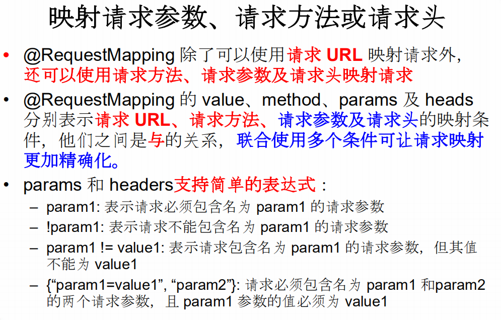
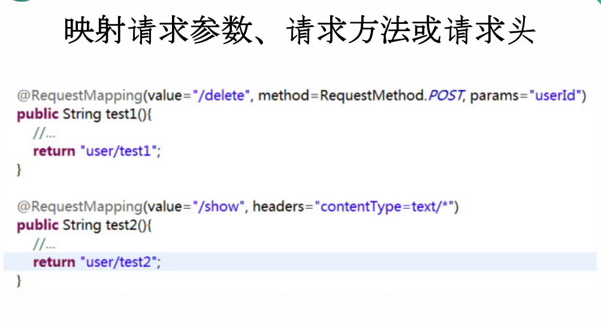
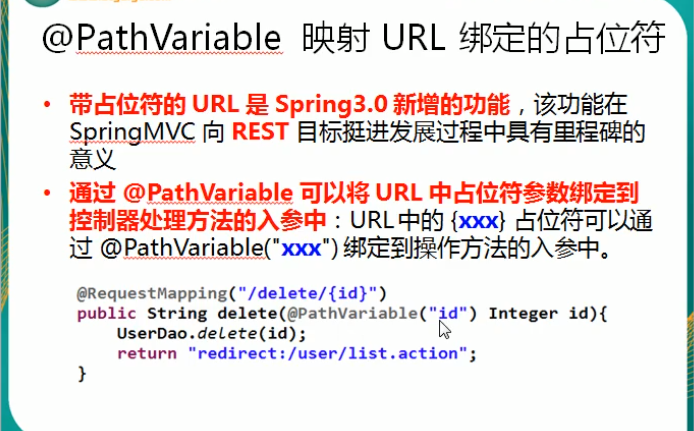
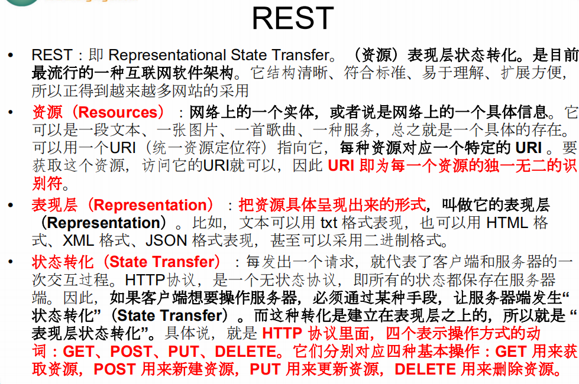
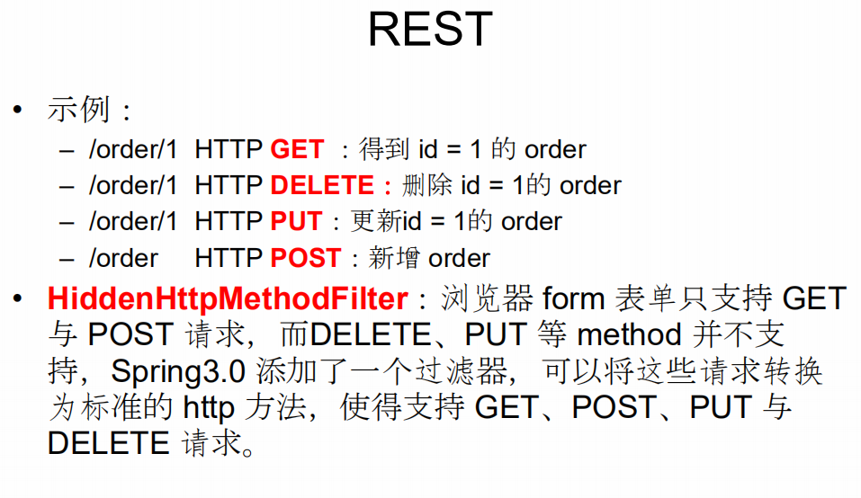

# springmvc_learn 2019年9月15日13:16:44

## 1 配置文件

### 1.1 pom.xml

~~~xml
<?xml version="1.0" encoding="UTF-8"?>

<project xmlns="http://maven.apache.org/POM/4.0.0" xmlns:xsi="http://www.w3.org/2001/XMLSchema-instance"
  xsi:schemaLocation="http://maven.apache.org/POM/4.0.0 http://maven.apache.org/xsd/maven-4.0.0.xsd">
  <modelVersion>4.0.0</modelVersion>

  <groupId>com.richard</groupId>
  <artifactId>springmvc_0915</artifactId>
  <version>1.0-SNAPSHOT</version>
  <packaging>war</packaging>

  <name>springmvc_0915 Maven Webapp</name>
  <!-- FIXME change it to the project's website -->
  <url>http://www.example.com</url>

  <properties>
    <project.build.sourceEncoding>UTF-8</project.build.sourceEncoding>
    <maven.compiler.source>1.7</maven.compiler.source>
    <maven.compiler.target>1.7</maven.compiler.target>
    <spring.version>4.1.9.RELEASE</spring.version>
  </properties>

  <dependencies>
    <dependency>
      <groupId>junit</groupId>
      <artifactId>junit</artifactId>
      <version>4.11</version>
      <scope>test</scope>
    </dependency>

    <dependency>
      <groupId>org.projectlombok</groupId>
      <artifactId>lombok</artifactId>
      <version>1.18.8</version>
    </dependency>
    <dependency>
      <groupId>org.springframework</groupId>
      <artifactId>spring-core</artifactId>
      <version>${spring.version}</version>
    </dependency>

    <!-- spring IOC的基础实现，包含访问配置文件、创建和管理bean等 -->
    <dependency>
      <groupId>org.springframework</groupId>
      <artifactId>spring-beans</artifactId>
      <version>${spring.version}</version>
    </dependency>

    <dependency>
      <groupId>org.springframework</groupId>
      <artifactId>spring-context</artifactId>
      <version>${spring.version}</version>
    </dependency>

    <dependency>
      <groupId>org.springframework</groupId>
      <artifactId>spring-context-support</artifactId>
      <version>${spring.version}</version>
    </dependency>

    <dependency>
      <groupId>org.springframework</groupId>
      <artifactId>spring-web</artifactId>
      <version>${spring.version}</version>
    </dependency>

    <dependency>
      <groupId>org.springframework</groupId>
      <artifactId>spring-webmvc</artifactId>
      <version>${spring.version}</version>
    </dependency>

    <dependency>
      <groupId>org.springframework</groupId>
      <artifactId>spring-tx</artifactId>
      <version>${spring.version}</version>
    </dependency>

    <dependency>
      <groupId>org.springframework</groupId>
      <artifactId>spring-aop</artifactId>
      <version>${spring.version}</version>
    </dependency>

    <dependency>
      <groupId>org.springframework</groupId>
      <artifactId>spring-aspects</artifactId>
      <version>${spring.version}</version>
    </dependency>

    <dependency>
      <groupId>org.springframework</groupId>
      <artifactId>spring-jdbc</artifactId>
      <version>${spring.version}</version>
    </dependency>

    <dependency>
      <groupId>commons-logging</groupId>
      <artifactId>commons-logging</artifactId>
      <version>1.2</version>
    </dependency>

  </dependencies>

  <build>
    <finalName>springmvc_0915</finalName>
  </build>
</project>

~~~

### 1.2 web.xml

~~~xml
<!DOCTYPE web-app PUBLIC
 "-//Sun Microsystems, Inc.//DTD Web Application 2.3//EN"
 "http://java.sun.com/dtd/web-app_2_3.dtd" >

<web-app xmlns="http://xmlns.jcp.org/xml/ns/javaee" xmlns:xsi="http://www.w3.org/2001/XMLSchema-instance"
         xsi:schemaLocation="http://xmlns.jcp.org/xml/ns/javaee
                      http://xmlns.jcp.org/xml/ns/javaee/web-app_3_1.xsd"
         version="3.1" metadata-complete="true">

  <display-name>Archetype Created Web Application</display-name>
  <context-param>
    <param-name>contextConfigLocation</param-name>
    <param-value>classpath*:spring/applicationContext.xml</param-value>
  </context-param>
  <listener>
    <listener-class>org.springframework.web.context.ContextLoaderListener</listener-class>
  </listener>

  <servlet>
    <servlet-name>springmvc</servlet-name>
    <servlet-class>org.springframework.web.servlet.DispatcherServlet</servlet-class>
    <init-param>
      <param-name>contextConfigLocation</param-name>
      <param-value>classpath*:spring/springmvc-config.xml</param-value>
    </init-param>
    <load-on-startup>1</load-on-startup>
  </servlet>
  <servlet-mapping>
    <servlet-name>springmvc</servlet-name>
    <url-pattern>/</url-pattern>
  </servlet-mapping>

  <welcome-file-list>
    <welcome-file>login.jsp</welcome-file>
  </welcome-file-list>

  <!-- utf8 过滤 -->
  <filter>
    <filter-name>encodingFilter</filter-name>
    <filter-class>org.springframework.web.filter.CharacterEncodingFilter</filter-class>
    <init-param>
      <param-name>encoding</param-name>
      <param-value>utf-8</param-value>
    </init-param>
    <init-param>
      <param-name>forceEncoding</param-name>
      <param-value>true</param-value>
    </init-param>
  </filter>

  <filter-mapping>
    <filter-name>encodingFilter</filter-name>
    <url-pattern>/*</url-pattern>
  </filter-mapping>

</web-app>

~~~

### 1.3 springmvc-config.xml

~~~xml
<?xml version="1.0" encoding="UTF-8"?>
<beans xmlns="http://www.springframework.org/schema/beans"
       xmlns:mvc="http://www.springframework.org/schema/mvc" xmlns:context="http://www.springframework.org/schema/context"
       xmlns:tx="http://www.springframework.org/schema/tx" xmlns:aop="http://www.springframework.org/schema/aop"
       xmlns:p="http://www.springframework.org/schema/p" xmlns:xsi="http://www.w3.org/2001/XMLSchema-instance"
       xmlns:cache="http://www.springframework.org/schema/cache"
       xsi:schemaLocation="
        http://www.springframework.org/schema/beans
        http://www.springframework.org/schema/beans/spring-beans.xsd
        http://www.springframework.org/schema/mvc
        http://www.springframework.org/schema/mvc/spring-mvc.xsd
        http://www.springframework.org/schema/context
        http://www.springframework.org/schema/context/spring-context.xsd">

    <mvc:annotation-driven></mvc:annotation-driven>
    <mvc:default-servlet-handler></mvc:default-servlet-handler>

    <context:component-scan base-package="com.richard.*"></context:component-scan>

    <!--配置静态资源映射,防止静态资源被拦截  -->
    <mvc:resources location="/WEB-INF/pages/" mapping="/pages/**"/>

    <bean class="org.springframework.web.servlet.view.InternalResourceViewResolver">
        <property name="prefix" value="/WEB-INF/pages/" />
        <property name="suffix" value=".jsp" />
    </bean>

</beans>
~~~

### 1.4 applicationContext.xml

~~~xml
<?xml version="1.0" encoding="UTF-8"?>
<beans xmlns="http://www.springframework.org/schema/beans"
       xmlns:xsi="http://www.w3.org/2001/XMLSchema-instance"
       xsi:schemaLocation="http://www.springframework.org/schema/beans
	http://www.springframework.org/schema/beans/spring-beans.xsd">

</beans>
~~~

## 2 RequestMapping

## 3 pathVariable

~~~java
<a href="hello/testPathVariable/1">Test PathVariable</a>

public static final String success="success";
	
	@RequestMapping("/testPathVariable/{id}")
	public String testPathVariable(@PathVariable("id")Integer id){
		System.out.println("testPathVariable "+id);
		return success;
	}
~~~

## 4 Rest风格

~~~java
web.xml 需要配置一个filter

 <!--HiddenHttpMethodFilter 可以将post请求转换为delete或者put请求-->
  <filter>
    <filter-name>HiddenHttpMethodFilter</filter-name>
    <filter-class>org.springframework.web.filter.HiddenHttpMethodFilter</filter-class>
  </filter>
  <filter-mapping>
    <filter-name>HiddenHttpMethodFilter</filter-name>
    <url-pattern>/*</url-pattern>
  </filter-mapping>
  
  ------------------------------------------------------------

<form action="hello/testRest/1" method="post">
		<input type="hidden" name="_method" value="DELETE">
		<input type="submit" value="Test Rest Delete">
</form>
 
<form action="hello/testRest/1" method="post">
		<input type="hidden" name="_method" value="PUT">
		<input type="submit" value="Test Rest Put">
</form>
 
<form action="hello/testRest" method="post">
		<input type="submit" value="Test Rest Post">
</form>
 
<a href="hello/testRest/1">Test Rest Get</a>

	@ResponseBody
	@RequestMapping(value = "/testRest/{id}",method = RequestMethod.PUT)
	public String testRestPut(@PathVariable Integer id){
		System.out.println("testRestPut "+id);
		return success;
	}
	
	@RequestMapping(value = "/testRest/{id}",method = RequestMethod.DELETE)
	public String testRestDelete(@PathVariable Integer id){
		System.out.println("testRestDelete "+id);
		return success;
	}
	
	@RequestMapping(value = "/testRest",method = RequestMethod.POST)
	public String testRestPost(){
		System.out.println("testRestPost");
		return success;
	}
	
	@RequestMapping(value = "/testRest/{id}",method = RequestMethod.GET)
	public String testRestGet(@PathVariable Integer id){
		System.out.println("testRestGet "+id);
		return success;
	}
~~~

## 5 RequestParam

~~~java
<a href="hello/testRequestParam?username=zhangsan&age=20">Test RequestParam</a>
  

	@RequestMapping("/testRequestParam")
	public String testRequestParam(@RequestParam(value = "username")String un,
	                               @RequestParam(value = "age",,required = false,defaultValue = "0")Integer age){
		System.out.println("testRequestParam "+",username "+un+",age "+age);
		return success;
	}
~~~

## 6 RequestHeader

## 7 CookieValue

## 8 pojo

~~~java
<form action="hello/testPojo" method="post">
		username:<input type="text" name="username">
		 
		password:<input type="password" name="password">
		 
		email:<input type="text" name="email">
		 
		age:<input type="text" name="age">
		 
		province:<input type="text" name="address.province">
		 
		city:<input type="text" name="address.city">
		 
		<input type="submit" value="Submit">
</form>

@Data
@AllArgsConstructor
@NoArgsConstructor
@Builder
public class user {
	private String username;
	private String password;
	private String email;
	private Integer age;
	
	private address address;
}

@Data
@AllArgsConstructor
@NoArgsConstructor

public class address {
	private String province;
	private String city;
}

--实现类
	@RequestMapping(value = "/testPojo",method = RequestMethod.POST)
	public String testPojo(user user){
		System.out.println(user);
		return success;
	}
	
	
~~~

## 9 ServletAPI

~~~
MVC 的 Handler 方法可以接受哪些 ServletAPI 类型的参数

。HttpServletRequest
• HttpServletResponse
• HttpSession
• java.security.Principal
• Locale
• InputStream
• OutputStream
• Reader
• Writer
~~~

## 10 处理模型数据

### 10.1 ModelAndView

~~~
• 控制器处理方法的返回值如果为 ModelAndView, 则其既包含视图信息，也包含模型数据信息。 
• 添加模型数据: 
	– MoelAndView addObject(String attributeName, Object attributeValue) 
	– ModelAndView addAllObject(Map<String, ?> modelMap)
• 设置视图: 
	– void setView(View view) 
	– void setViewName(String viewName)j
~~~

~~~java
--1 页面
<a href="hello/testModelAndView">Test ModelAndView</a>
  

--2 controller
@RequestMapping(value = "/testModelAndView")
	public ModelAndView testModelAndView(){
		String viewName="success";
		ModelAndView mv=new ModelAndView(viewName);
		mv.addObject("time",new Date());
		return mv;
	}

--3 页面 
 
time: ${requestScope.time}

~~~

### 10.2 Map

~~~
--1 页面
<a href="hello/testMap">Test Map</a>
  
--2 controller

@RequestMapping(value = "/testMap")
	public String testMap(Map<String,Object>map){
		map.put("names", Arrays.asList("tom","jerry","jack"));
		return success;
	}
-- 3 页面
 
names:${requestScope.names}
~~~

### 10.3 SessionAttributes 

~~~
希望在多个请求之间共用模型数据 则可以在控制器类上标注一个 @SessionAttributes, Spring MVC 将在模型中对应的属性暂存到 HttpSession 中。

@SessionAttributes 除了可以通过属性名指定需要放到会
话中的属性外，还可以通过模型属性的对象类型指定哪些
模型属性需要放到会话中 – @SessionAttributes(types=User.class) 会将隐含模型中所有类型 为 User.class 的属性添加到会话中。
– @SessionAttributes(value={“user1”, “user2”})
– @SessionAttributes(types={User.class, Dept.class})
– @SessionAttributes(value={“user1”, “user2”}, 
types={Dept.class})
~~~

## 11 redirect  forward

~~~
--1 页面
<a href="hello/testRedirect">Test Redirect</a>
  

--2 controller
@RequestMapping(value = "/testRedirect")
	public String testRedirect(){
		System.out.println("testRedirect");
		return "redirect:/index.jsp";
	}
	
~~~

## 12 CRUD

### 12.1 JSTL

~~~xml
<!-- JSTL -->
    <dependency>
      <groupId>javax.servlet</groupId>
      <artifactId>jstl</artifactId>
      <version>1.2</version>
    </dependency>
    <!-- JSTL实现包 -->
    <dependency>
      <groupId>org.apache.taglibs</groupId>
      <artifactId>taglibs-standard-impl</artifactId>
      <version>1.2.5</version>
    </dependency>
~~~

~~~jsp
<%@ page contentType="text/html;charset=UTF-8" language="java" %>
<%@ taglib uri="http://java.sun.com/jsp/jstl/core" prefix="c" %>
<html>
<head>
		<title>List</title>
</head>
<body>

<c:if test="${empty requestScope.employees}">
		没有任何员工信息显示
</c:if>
<c:if test="${!empty requestScope.employees}">
		<table border="1" cellpadding="10" cellspacing="0">
				<tr>
						<th>ID</th>
						<th>LastName</th>
						<th>Email</th>
						<th>Gender</th>
						<th>Department</th>
						<th>Eidt</th>
						<th>Delete</th>
				</tr>
				<c:forEach items="${requestScope.employees}" var="emp">
						<tr>
								<td>${emp.id}</td>
								<td>${emp.lastName}</td>
								<td>${emp.email}</td>
								<td>${emp.gender==0 ? 'Female':'Male'}</td>
								<td>${emp.department.departmentName}</td>
								<td><a href="">Edit</a></td>
								<td><a href="">Delete</a></td>
						</tr>
				</c:forEach>
		</table>
</c:if>
</body>
</html>

~~~

~~~java

@Controller
public class EmployeeHandler {
	@Autowired
	private EmployeeDao employeeDao;
	
	@RequestMapping("/emps")
	public String list(Map<String,Object>map){
		map.put("employees",employeeDao.getAll());
		return "list";
	}
}

~~~

### 12.2 处理静态资源

~~~markdown
优雅的 REST 风格的资源URL 不希望带 .html 或 .do 等后缀 • 若将 DispatcherServlet 请求映射配置为 /，则 Spring MVC 将捕获
WEB 容器的所有请求，包括静态资源的请求， SpringMVC 会将他
们当成一个普通请求处理，因找不到对应处理器将导致错误。 • 可以在 SpringMVC 的配置文件中配置 <mvc:default-servlethandler/> 的方式解决静态资源的问题： – <mvc:default-servlet-handler/> 将在 SpringMVC 上下文中定义一个
DefaultServletHttpRequestHandler，它会对进入 DispatcherServlet 的 请求进行筛查，如果发现是没有经过映射的请求，就将该请求交由 WEB 
应用服务器默认的 Servlet 处理，如果不是静态资源的请求，才由
DispatcherServlet 继续处理 – 一般 WEB 应用服务器默认的 Servlet 的名称都是 default。若所使用的
WEB 服务器的默认 Servlet 名称不是 default，则需要通过 defaultservlet-name 属性显式指定
~~~

~~~xml
springmvc-config.xml

<mvc:annotation-driven></mvc:annotation-driven>
<mvc:default-servlet-handler></mvc:default-servlet-handler>
~~~

